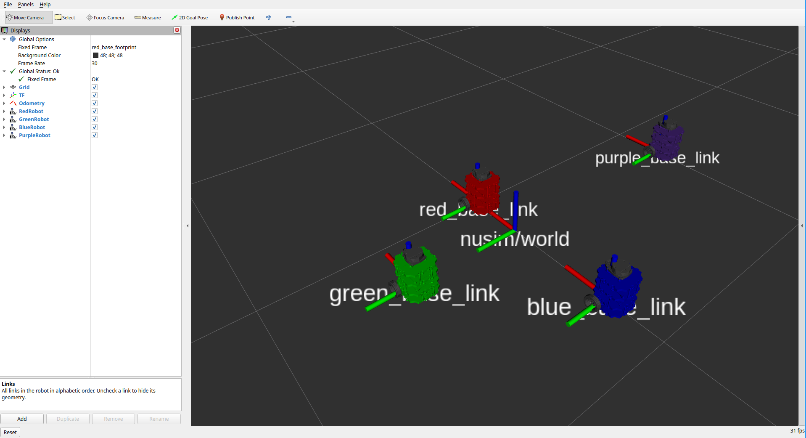
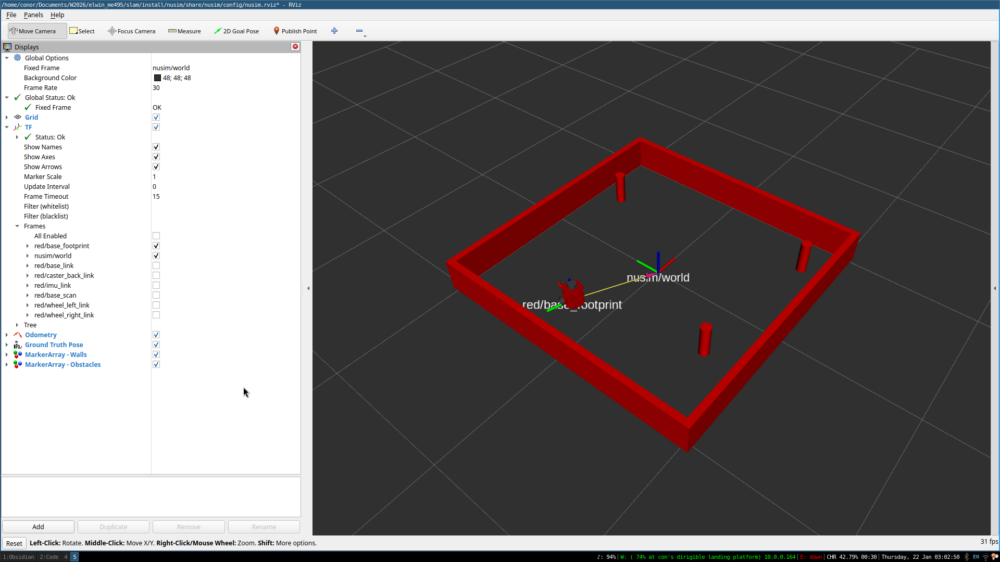

# ME495 Sensing, Navigation, and Machine Learning for Robotics
* Conor Hayes
* Winter 2025

# Setup
## System Requirements
This repo has been tested with the following system configuration:
- ROS 2 Kilted Kaiju
- g++-14 compiler
- Ubuntu 24.04

It likely works with other versions of the above, but this is untested.

## One-time setup
In order to build & use this package, do the following:
```bash
# clone the repo into a clean ROS workspace
SLAM_WS_NAME="slam-ws"   # use whatever workspace name you want
mkdir -p $SLAM_WS_NAME/src
cd $SLAM_WS_NAME/src
git clone git@github.com:ME495-Navigation/slam-cwoodhayes.git

# clone other needed repos
vcs import < slam-cwoodhayes/turtle.repos

# run one-time setup for package installation
./slam-cwoodhayes/setup.sh
```

# Package List
This repository consists of several ROS packages:
- `nuturtle_description` - contains models, configs, and visualization files for the `turtlebot3` burger, adapted from the official [turtlebot3_description](https://index.ros.org/p/turtlebot3_description/) package.
- `turtlelib` - a C++ library that implements a variety of geometric helper functions & visualization support using SVG's.
- `nusim` - a custom turtlebot arena simulator based on RViz which supports our SLAM algorithm development

# Nuturtle Description
URDF files for Nuturtle 
* `ros2 launch nuturtle_description load_one.launch.xml` to see the robot in rviz.
* `ros2 launch nuturtle_description load_all.launch.xml` to see four copies of the robot in rviz.

* The rqt_graph when all four robots are visualized (Nodes Only, Hide Debug) is:


## Launch File Details
* `ros2 launch nuturtle_description load_one.launch.xml --show-arguments`
```
  Arguments (pass arguments as '<name>:=<value>'):

    'use_rviz':
        Launch RViz for visualization
        (default: 'true')

    'use_jsp':
        Launch joint_state_publisher for default joint states
        (default: 'true')

    'color':
        Determines namespace for nodes launched by this file, and colors the URDF model. Valid choices are: ['red', 'green', 'blue', 'purple']
        (default: 'purple')
```
* `ros2 launch nuturtle_description load_all.launch.xml --show-arguments`

The `load_all` launchfile accepts no arguments; however, the above command will display 
arguments from the `load_one` launchfile as shown above due to a known bug in `launch`. 

# turtlelib Description
Implements geometric primitives and operations upon them.
- `angle.hpp` - helper functions for working with angles in degrees and radians
- `geometry2d.hpp` - two-dimensional geometric primitives (Points, Vectors) and operations upon them
- `se2d.hpp` - two-dimensional SE2 transformations + twists, that can operate on points + vectors
- `svg.hpp` - visualization functions for the above using SVG files as output.
- `diff_drive.hpp` - handles inverse and forward kinematics for an arbitrary diff-drive robot

# nusim Description
A custom turtlebot arena simulator based on rviz. 

## Simulator Setting Parameters
The following parameters are available on the `nusimulator` node provided
by this package to control the simulation:

- `rate` - Simulation rate in Hz (default: 100.0)
- `x0` - Initial ground-truth x position of the turtlebot (default: 0.0)
- `y0` - Initial ground-truth y position of the turtlebot (default: 0.0)
- `theta0` - Initial ground-truth orientation of the turtlebot (default: 0.0)
- `arena_x_length` - Length of the arena in the world X direction (default: 10.0)
- `arena_y_length` - Length of the arena in the world Y direction (default: 10.0)
- `obstacles.x` - X coordinates of obstacles (default: empty)
- `obstacles.y` - Y coordinates of obstacles (default: empty)
- `obstacles.r` - Radius of obstacles (default: 0.0)


## Launch File Details
This package has one launch file (`nusim.launch.xml`) which spawns a single
robot in an rviz view, as well as arena walls and cylindrical obstacles.
The robot's position can be reset to its spawn point with the `/reset` service.

* `ros2 launch nusim nusim.launch.xml --show-arguments`:
```
Arguments (pass arguments as '<name>:=<value>'):

    'config_file':
        YAML file to configure the simulator.
        (default: 'config/basic_world.yaml')
```


