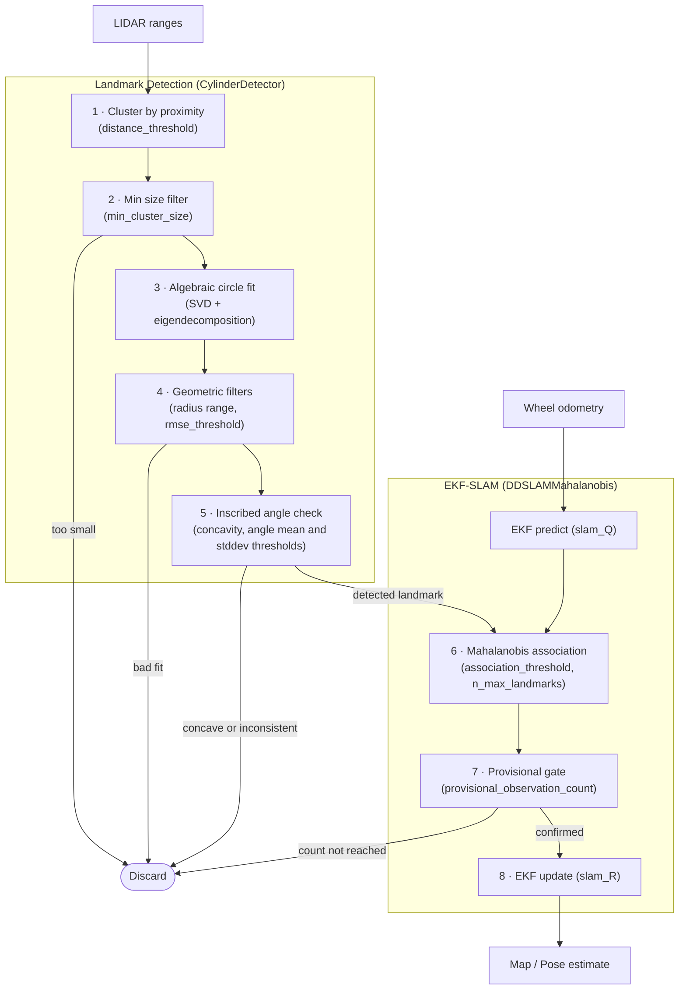

# NUSLAM

## Demonstration in Nusim

https://github.com/user-attachments/assets/ea1a8a6e-004b-4681-86aa-999a3f587f48

> Driving the robot around a closed path, observing the environment only using (simulated) lidar. The robot builds a map online (green) using EKF-SLAM, with circle detection + clustering to detect landmarks (white) and data association using Mahalanobis distance. The map is visualized in RViz, and the ground truth map (red) + odometry-based estimate (blue robot) is shown for comparison. Note that when the robot collides with an obstacle, the odometry-based estimate diverges significantly, while the SLAM estimate remains accurate by leveraging the landmarks in the environment.

After this closed loop is complete, the ground truth, odometry, and SLAM poses are as follows:

- Ground Truth (red)
	- (x, y, z) = -0.0038688; 0.029482; 0
	- (qx, qy, qz, qw) = 0; 0; -0.099636; 0.99502
- SLAM estimate (green)
	- (x, y, z) = 0.016987; 0.01215; 0
	- (qx, qy, qz, qw) = 0; 0; -0.094745; 0.9955
- Odometry-only estimate (blue)
	- (x,y,z) = -1.1721; -0.84761; 0
	- (qx, qy, qz, qw) = 0; 0; -0.056191; 0.99842

**Final SLAM position error**: 0.027m
**Final Odometry-only position error**: 1.46m

## Demonstration in Real World

https://github.com/user-attachments/assets/1179359c-8443-42d2-a3f8-9bd3460544c9

> Above: Running `nuslam`'s SLAM algorithm in real-time on the  turtlebot3. Key: Green/multicolored dots: LIDAR scan points. Green obstacles+robot+path = SLAM estimate. Blue robot+path = odometry-only estimate. White obstacles=landmarks detected by the `landmarks` node (see below), which feed into SLAM. SLAM's robot pose covariance is shown as the purple ellipse and yellow cone. **Note that the odometry-only estimate gradually diverges from the ground truth as shown in the real-world video on the left, while the SLAM estimate correctly stays with ground truth.** See [here](images/slam_irl_result.png) for a still image of the robot poses at the end of the video demonstrating this.

After this closed loop is complete, with the robot parked roughly at the real-world starting point, the odometry and SLAM poses are as follows:

- Ground Truth (top left video -- rough estimate)
	- (x, y, z) = (0, 0, 0)
- SLAM estimate (green)
	- (x, y, z) = 0.040364; 0.030199; 0.0
	- (qx, qy, qz, qw) = 0; 0; 0.81067; 0.5855
- Odometry-only estimate (blue)
	- (x,y,z) = 0.010667; 0.29087; 0.0
	- (qx, qy, qz, qw) = 0; 0; 0.72989; 0.68356

**Final SLAM position error (estimated)**: 0.05m
**Final Odometry-only position error (estimated)**: 0.29m

## SLAM Pipeline Summary

1. **Cluster raw LIDAR points** — convert range readings to Cartesian, group consecutive points within `distance_threshold`. A wrap-around check merges the last cluster with the first if they are close.
2. **Minimum size filter** — clusters with fewer than `min_cluster_size` points are discarded.
3. **Algebraic circle fit** — fits a circle to the cluster via SVD + eigendecomposition (Taubin method). Produces a center, radius, and RMSE.
4. **Geometric filters** — rejects fits whose radius falls outside the realistic cylinder range for the obstacles we're using, or whose RMSE exceeds `rmse_threshold`.
5. **Inscribed angle check** — three sub-checks: (a) concavity: interior points must be closer to the sensor than the endpoints (rejects walls), controlled by `concavity_threshold`; (b) mean inscribed angle must fall within `inscribed_angle_mean_range_deg`; (c) std dev of inscribed angles must be below `inscribed_angle_stddev_threshold_deg`.
6. **Mahalanobis data association** — for each surviving detected circle, compute Mahalanobis distance to every known landmark in the EKF state. Best match below `slam_mahalanobis_association_threshold` associates with that landmark; otherwise a new landmark is created (up to `slam_n_max_landmarks`).
7. **Provisional gate** — new landmarks must accumulate `slam_mahalanobis_provisional_observation_count` observations before their measurements feed into the EKF, preventing transient detections from corrupting the map.
8. **EKF update** — confirmed measurements update the EKF state using measurement covariance `slam_R`.
